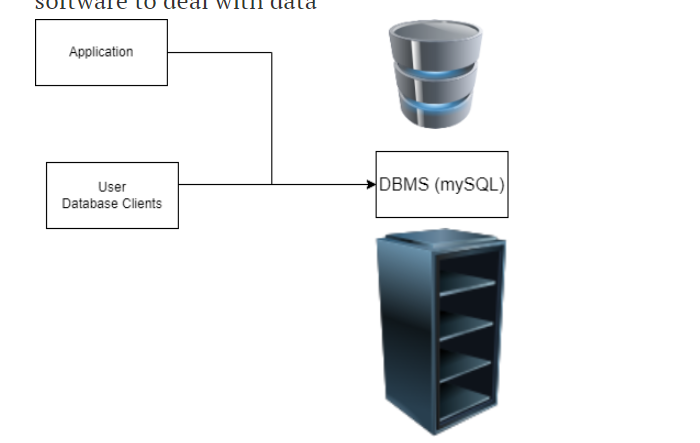
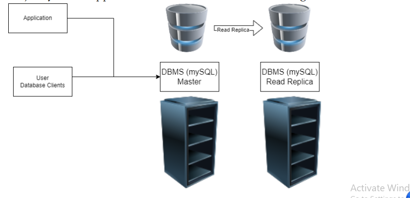
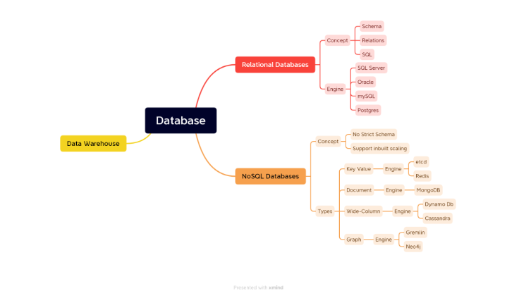

        database:
--------------------------
        to store the data
    1)file:  its strore the data is retrive , draw back of this file is we can't work with multiple users on same XL sheet(same file)  at a time .
    2) database) data base is a collection of information 
        DBMS: (data base management system) dbms are softwares/ engines which allows multiple users to parellely work on same data either it read/write(read: select , write: creaate/update/insert the data)

type of database:

    1)relational database: 

* Relational Database are concept of Databases , we are design the data in terms of tables with rows and columes . the structure of the table is called as schema .
    each row repracend a record
    tables will maintaine unique structure
 relational db does not depends on the horizantal scalling because  application will split into microlithic process (Ex: book ticket it stores one server but our payment process stores in another because of load will be increases extra server will takes by using horizantal scalling )
 * vertical scalling is designed for relational db (it's designed for the read/write operations in single server , if we have too many  work loads we can increase the size of the server )

popular languages  of db engines
    * ms SQL db
    * Oracle
    * my SQL
    * maria db
    * postgre SQL
    * DB2

* db are used from application code aswell as db client s/w deal with data 

SCALLiNG: majority of the application read more data then write(in this we have 2 servers one is master(write) , one is read . if incase we have too many read servers we can use)

ADMINISTRATION: 
     to installing or patching or configuring 
        os
        dbms
    user management
    connection management
    backups and recovery
    performence tuning
    replications

2) NO SQL db: it has semi structure information .it is designed to support inbuild horizantal scalling . it does not imposed strict schemas(ex: fb, whats up msgs)

    types of no sql db

dynamodb: lot of write papers which is push to the databa 
    it's support horizantal scalling content will not stores directly
in  horizantal scalling we have bidirectional 'replications' same way in vertical scalling we have one directional replications.

ON-PREMISES:

installing data in yor organizations/ server databases are generally servers which are connect from client in 3 popular ways
    1. command line
    2. GUI (grafical user interface)
    3. code (sdk)
ssms: sequel server management studio

db could not take extraspace when cpu and ram requires so we download SQL server then it creates service and backups with in 20min.

these server have more feautures and cost also high
* for database two componets are effected
    1. google(bigtable)
    2. amazon ( dynamodb ): open source application refactoring mysql, postgres are less cost, aurora
                            mango db
                            (aws)document dab
                            java
                              corratto
* 

### LOAD BALANCER

* * proxy serveer:
 
	filter out all the out bound network traffic(one service between clinet and application)
* revese proxy: 

filter out all the incomming traffic to the application

*** clint same its try to send traffic to same server(sticky section)

* loadbalancer:(to ensure request is forworded only the servers which are responding)
    (1)layer 4: ip,protocal, port
	
	(2)layer7:http, protocal,ip,sessions, sg(it's the little bit slow than layer -4)
	
* loadbalancer: 
		1. classic load balancers(4&7 layer lb ):  
		2.net-work lb: 4 layer(public dns present its have dns value)
		
		3. application lb: 7 layer (/order)
		
		4. gateway lb:
		route 53 is DNS as a service when ever giving to a own  organaization names 
		
		
		advanced details:
#### for clients we can't give this type of urls so
 * route 53 -- hosted zone --godaddy and chanch name server(it will take 24 hours)
 * local entries and create host file(we can't purchase  domain)

 

* first we create web ec2 , order ec2 and admin ec2
* and working of loadbalancer is depends on
		path
        headers
        ips
        delete loadbalancers: listeners , admin, lb
        

#### approches to run applications are 3

    (1) IAAS: we choose hardware configuration , OS and install platform , deploy application
    (2)  PAAS: in this we choose  virtual hardware ,OS, deploy and 
    (3) JiRA(SAAS):  we responsible only 
    (4) server less: we will be charge only how many persons request to use (LAMDA)
    (5) batch processing system: it's uses loads of servers in one day(for offer time)
### Diffent hosting options

#### hyperviser: 
    * on physical server we install hyperviser and it have vertual box , these vertual box is used to create no. of instances.

#### web hosting: 
    * single- tenant
    * multi- tenant
#### CoLO( co-Location):
     servers are ours but maintaines for another company
#### Rack space()

    * 
#### lamda 

##### aws bills for use services

* what should  i do and when should i use these options 

    (1) ad hoc customers: on-demand(no commitments hourly blling)

    (2) regular customers: reserve instances(1 year  or 3 year contracts (30-50%)) 

    (3) spot instance: 
    making revenue out of free hardware , we get the ec2 instance at lowest possible cost , butmwhen the cost increases the ec2 instance will be evicted fro you (most discounts based on demand )

### AMI (amazon machine image)

*  how to install os on your lap?
*       download software , install and configure

   * AMI is an packaging format ec2 instances which containes OS , necessary softwares 
   * AMI's are of 2 types of pricing 
   marketpalce AMIs 
        * you will have paid AMIs as well
            1. BYO

### aws atoscalling

* min no.of 
* desired no.of instances
* max no.of instances
* scalling rules
#### scallings are 2 types :
#### 1* dynamic scalling

    1. steps scalling (cpu utolization is >=75% : (you will be controle)when to increas and when to dicreasing)
    2. target scalling (in your application where it works (it's not in our controle) )
    3. simple scalling
(predictive scalling policies: ) 
(sheduler:you know that perticular time to increase and decrease instances)
* we use existing launch template
  * IN ASG , they have desired count 
  * ASG are used in two cases 
    * always
    * cpu (htop)
      we will used "stress " its automatically increase cpu
    * ram
    * i/o
    * 
    (1) horizantal auto scalling (scalling out and scalling in)
    (2) vertical auto scalling (scalling up and scalling down)

### launch templete
    why we choose more times then we create most frequently used templete's

###  elastic beanstack
no need to install ec2 instance and running commands we use elastc bean stack
   it's looks like paas
   it has 2 environments 
    1. web server environment: 
    2. worker environment: runs in back ground 
### platform: 
    * platform is nothing bt combination of OS + web/app server

## create elastic beamstack 
 * create elastic beam stack
 
 
 
 
 
 * create one IAM user
 * install awsebcli on windows and aws cofigure
 
 ### blue feild and green feild

 ### 

