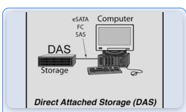
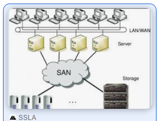
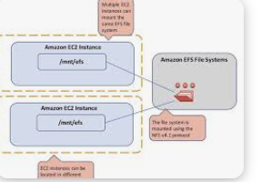
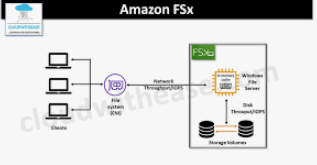

As a DevOps engineer, I'll guide you through troubleshooting and resolving latency issues in your application.

*Step 1

### Identify the Source of Latency*

1. Monitor application performance using tools like:
    - New Relic (`npi install newrelic`)
    - Datadog (`datadog-agent start`)
    - Prometheus (`prometheus --config.file=prometheus.yml


### initial checks 

* sudo systremctl status (system is running or not)

* ping -c 4 ipv4 (check the network connectivity)

* sudo iptables -n -L (check sg)

* dig/host domine name (verify the dns)

* dig -x ipv4
  
* host ipv4

* nslookup ipv4

* whois ipv4

* ip addr show
  ### latency issues

  * top
  * htop
  * mpstat -p all (to check the cpu utilizations)
 
  * vmstat
  * free -m (check the memory)
  * watch -n |free -m
 
  * df -h
  * dust
  * du -sh (to check the disk space )
 
  * netstat -an
  * tcpdump -i any -n -vv -s 0 -c 100 (to find network traffic)
 
    ### accesability issues

    * sudo iptables -n -L (check firewall rules)
   
    * sudo ufw status
   
    ### check port availability

    * netstat -tlnp | grep port-number
   
    * telnet instance-ip port-number
   
    ### ssl / tls configuration

    openssl s-client -connect ipv4: port

  ### check application logs

  * sudo journalctl -u app-service
 
  * sudo grep error-msg /var/log/app.log
 
  * mtr instance-ip (both routing and telnet)
 
  * traceroute ipv4
    
### Analyze logs for errors or slow queries:
    - `grep "slow query" /var/log/mysql/error.log` (MySQL)
    - `grep "timeout" /var/log/nginx/error.log` (Nginx)


### Check system resources:

    - `top` or `htop` for CPU usage
    - `free -m` for memory usage
    - `df -h` for disk usage

*Step 2: Optimize Server Configuration*
###  Adjust server settings:
    - `sysctl -w net.core.somaxconn=1024` (increase TCP connections)

    - `echo "1024" > /proc/sys/net/core/somaxconn` (persist changes)

2. Tune database configuration:

    - `mysqltuner --buffers` (MySQL)

    - `pgtune --buffers` (PostgreSQL)

3. Configure caching:
    - `redis-cli CONFIG SET maxmemory 2gb` (Redis)
    - `memcached -d -m 1024 -p 11211` (Memcached)

### Improve Network Performance*

1. Check network latency:
    - `ping -c 10 (link unavailable)`
    - `mtr (link unavailable)`

2. Optimize DNS resolution:
    - `dig +short (link unavailable)`
    - `nameserver 8.8.8.8` (Google Public DNS)

3. Enable keep-alive:
    - `nginx -s reload` (Nginx)
    - `service apache2 restart` (Apache)

### : Optimize Application Code*

1. Profile application performance:
    - `node --prof` (Node.js)
    - `python -m cProfile` (Python)

2. Optimize database queries:
    - `EXPLAIN SELECT * FROM table` (MySQL)
    - `EXPLAIN (ANALYZE) SELECT * FROM table` (PostgreSQL)

3. Minify and compress assets:
    - `gulp uglify`
    - `gzip -9`

*Step 5: Verify and Monitor*

1. Test application performance:
    - `ab -n 1000 -c 100 (link unavailable)
    - `siege -c 100 -t 1M (link unavailable)

2. Monitor performance metrics:
    - `prometheus --config.file=prometheus.yml`
    - `grafana-server --config=grafana.ini`

*Common Commands*

- `curl -o /dev/null -s -w %{time_total} (link unavailable) (measure latency)
- `tcpdump -i any -n -vv -s 0 -c 100 -W 100` (capture network traffic)

- `sysdig -c topfiles_bytes` (monitor file system activity)

- `docker stats` (monitor container resources)
### additional Tools*

- `nginx -t` (test Nginx configuration)

- `apachectl -t` (test Apache configuration)

- `mysqlcheck --optimize` (optimize MySQL database)

- `pg_restore --clean` (restore PostgreSQL database)

*Troubleshooting Checklist*

1. Verify server resources and configuration.

2. Analyze logs for errors or slow queries.

3. Check network latency and DNS resolution.

4. Optimize database configuration and queries.

5. Profile application performance and optimize code.

By following these steps and using these commands, you should be able to identify and resolve latency issues in your application.

Would you like me to elaborate on any specific step or command?

        database:
--------------------------
        to store the data
    1)file:  its strore the data is retrive , draw back of this file is we can't work with multiple users on same XL sheet(same file)  at a time .

    2) database: data base is a collection of information 

        DBMS: (data base management system) dbms are softwares/ engines which allows multiple users to parellely work on same data either it read/write(read: select , write: creaate/update/insert the data)

type of database:


    1)relational database: 


* Relational Database are concept of Databases , we are design the data in terms of tables with rows and columes . the structure of the table is called as schema .

    each row repracend a record

    tables will maintaine unique structure

 relational db does not depends on the horizantal scalling because  application will split into microlithic process (Ex: book ticket it stores one server but our payment process stores in another because of load will be increases extra server will takes by using horizantal scalling )

 * vertical scalling is designed for relational db (it's designed for the read/write operations in single server , if we have too many  work loads we can increase the size of the server )

popular languages  of db engines

    * ms SQL db

    * Oracle

    * my SQL

    * maria db

    * postgre SQL

    * DB2

* db are used from application code aswell as db client s/w deal with data 


SCALLiNG: majority of the application read more data then write(in this we have 2 servers one is master(write) , one is read . if incase we have too many read servers we can use)


### BACKUP

let's enable no backups setup

* manual backup

* 

* restore snapshot

* copy snapshots (other region)

* sharing snapshot( its copy one aws a/c to another aws a/c)

* valut is a storage 

#### differential backup

#### 

we want time based backup is called ""

#### replicas 

* what ever the databases are changes replicas do the changes in backups also

 


ADMINISTRATION: 

     to installing or patching or configuring 

        os

        dbms

    user management
    
    connection management
    
    backups and recovery
    
    performence tuning
    
    replications

2) NO SQL db: it has semi structure information .it is designed to support inbuild horizantal scalling . it does not imposed strict schemas(ex: fb, whats up msgs)

    types of no sql db


dynamodb: lot of write papers which is push to the databa 

    it's support horizantal scalling content will not stores directly
in  horizantal scalling we have bidirectional 'replications' same way in vertical scalling we have one directional replications.


### mysql data bases

ALTER USER 'root'@'localhost' IDENTIFIED BY 'hema@203';

        CREATE DATABASE HH;

        USE HH;


        show databases;

        CREATE TABLE `databasename`.`tablename` (_id int not null,LastName varchar(255) NOT NULL, FirstName varchar(255),Age int,PRIMARY KEY (_id));

        desc <table-name>;

        alter table <tablename> add phonenumber int not null;

        alter table <tablename> modify phonenumber varchar(255);

        alter table <tablename> rename column _id to eid;

        truncate table <table name>


## syntax to get back to the table when you drop the table data
    
    * first we create the backup file for every data bases after we delete data it will stores inside the data bases

        mysqldump -u <username> -p <database name> > <backupFile name>

        mysql -u <user> -p

        drop table <tablename>;

    * goto the back up file it data will be stored


	flashback table <table name> to before drop;

	SHOW VARIABLES LIKE 'datadir';

	SHOW VARIABLES LIKE 'log_bin';


	SHOW BINARY LOGS;


### automatically insert the data into one table changes into another table


	CREATE TRIGGER insert_trigger
	AFTER INSERT ON source_table
	FOR EACH ROW
	INSERT INTO destination_table
	SELECT * FROM source_table;


### we cannot change more than one column 

        alter table <old table name> rename to <new table name>;

        alter table chaitu drop column <colun name>;
 
 


        CREATE TABLE `employee`.`employee` (emp_id int not null,first_name varchar(255) NOT NULL,lastname varchar(255) NOT NULL,pri_skill varchar(255
        ),location varchar(255));


        INSERT INTO 'HH'.'Hemalatha' (_id, LastName,FirstName) values ('203','Bijjam','hemalatha')

        INSERT INTO Hemalatha (_id,LastName,FirstName )VALUES ('3', 'maneee', 'm');

        INSERT INTO Hemalatha (_id,LastName,FirstName,age )VALUES ('333', 'eshu', 'll','29');

        SELECT * FROM Hemalatha;
        SELECT Age FROM Hemalatha;
        DELETE FROM Hemalatha WHERE Age=29;
        UPDATE RRR SET mobile=
        ALTER TABLE RRR MODIFY mobile varchar(256);


INSERT INTO RRR (mobile ,employee, address )VALUES ('99','babool','varangal');

select * from Hemalatha, RRR;

select _id as pid, LastName, null as cid, null as employee from Hemalatha union select null as mobile, null as , id as cid, name from cusMODIFY

## DATA MANIPULATION LANGUAGE (DDL){SUDI}

### INSERT

    (1) explicity method
        
        insert into <table name> values(value1,value2,....value n);

    (2)implicite

        insert into <table name> (column1 datatype(size),column2 datatype(size),....column n datatype(size)) ;

### UPDATE
     
        update <table name> set col1=value1, col2=value2, .... ,col n=value n;

### DELETE

        delete * from <table name>;

        delete <column> from <tablename>;
### SELECT


        select * from <table name>;

        select <column> from <table name>;
### alias

        1. column level alias

            *  select col1 as "aliasname", col2 as "aliasname",....., coln as "aliasname" from <tablename>;

        2. table level alias

           

        3. expression level alias

             * select col1 aliasname, col2 aliasname,....., coln aliasname from <tablename>;

### using select command we can retrive the data in 3 ways 

#### (1) projection 
        retrive the data from specific columns

        select col1,col2,...,coln from <table name>;

#### (2) selection
        retrive the data from some conditonsvin table

        select * from <tablename> where <condition>

#### (3) join

        select * from <table1>,<table2>,...<table n>;

        
         


        


ON-PREMISES:

installing data in yor organizations/ server databases are generally servers which are connect from client in 3 popular ways

    1. command line

    2. GUI (grafical user interface)

    3. code (sdk)

ssms: sequel server management studio

db could not take extraspace when cpu and ram requires so we download SQL server then it creates service and backups with in 20min.

these server have more feautures and cost also high

* for database two componets are effected
    1. google(bigtable)

    2. amazon ( dynamodb ): 
    open source application refactoring mysql, postgres are less cost, 
                            
                            aurora
                            
                            mango db
                            
                            (aws)document dab
                            
                            java
                            
                              corratto
* 

### LOAD BALANCER

* * proxy serveer:
 
	filter out all the out bound network traffic(one service between clinet and application)

* revese proxy: 

filter out all the incomming traffic to the application

*** clint same its try to send traffic to same server(sticky section)

* loadbalancer:(to ensure request is forworded only the servers which are responding)

    (1)layer 4: ip,protocal, port
	
	(2)layer7:http, protocal,ip,sessions, sg(it's the little bit slow than layer -4)
	
* loadbalancer: 

		1. classic load balancers(4&7 layer lb ):

		2.net-work lb: 4 layer(public dns present its have dns value)
		
		3. application lb: 7 layer (/order)
		
		4. gateway lb:

		route 53 is DNS as a service when ever giving to a own  organaization names 
		
		
		advanced details:

#### for clients we can't give this type of urls so

 * route 53 -- hosted zone --godaddy and chanch name server(it will take 24 hours)

 * local entries and create host file(we can't purchase  domain)


* first we create web ec2 , order ec2 and admin ec2

* and working of loadbalancer is depends on
		
        path
        
        headers
        
        ips
        
        delete loadbalancers: listeners , admin, lb
        


#### approches to run applications are 3

    (1) IAAS: we choose hardware configuration , OS and install platform , deploy application

    (2)  PAAS: in this we choose  virtual hardware ,OS, deploy and 
    
    (3) JiRA(SAAS):  we responsible only 
    
    (4) server less: we will be charge only how many persons request to use (LAMDA)
    
    (5) batch processing system: it's uses loads of servers in one day(for offer time)

### Diffent hosting options

#### hyperviser:

    * on physical server we install hyperviser and it have vertual box , these vertual box is used to create no. of instances.

#### web hosting: 


    * single- tenant

    * multi- tenant

#### CoLO( co-Location):

     servers are ours but maintaines for another company

#### Rack space()

    * 
#### lamda


##### aws bills for use services

* what should  i do and when should i use these options 

    (1) ad hoc customers: on-demand(no commitments hourly blling)

    (2) regular customers: reserve instances(1 year  or 3 year contracts (30-50%)) 

    (3) spot instance: 
    making revenue out of free hardware , we get the ec2 instance at lowest possible cost , butmwhen the cost increases the ec2 instance will be evicted fro you (most discounts based on demand )

### AMI (amazon machine image)

*  how to install os on your lap?
*       download software , install and configure

   * AMI is an packaging format ec2 instances which containes OS , necessary softwares 
   * AMI's are of 2 types of pricing 
   marketpalce AMIs 
        * you will have paid AMIs as well
            1. BYO


### aws atoscalling


* min no.of 
* desired no.of instances
* max no.of instances
* scalling rules
#### scallings are 2 types :
#### 1* dynamic scalling

    1. steps scalling (cpu utolization is >=75% : (you will be controle)when to increas and when to dicreasing)
    2. target scalling (in your application where it works (it's not in our controle) )
    3. simple scalling
(predictive scalling policies: ) 
(sheduler:you know that perticular time to increase and decrease instances)
* we use existing launch template
  * IN ASG , they have desired count 
  * ASG are used in two cases 
    * always
    * cpu (htop)
      we will used "stress " its automatically increase cpu
    * ram
    * i/o
    * 
    (1) horizantal auto scalling (scalling out and scalling in)
    (2) vertical auto scalling (scalling up and scalling down)

### launch templete
    why we choose more times then we create most frequently used templete's


###  elastic beanstack
no need to install ec2 instance and running commands we use elastc bean stack
   it's looks like paas
   it has 2 environments 
    1. web server environment: 
    2. worker environment: runs in back ground 
### platform: 
    * platform is nothing bt combination of OS + web/app server

## create elastic beamstack 
 * create elastic beam stack
 * 


 


 * create one IAM user
 * install awsebcli on windows and aws cofigure
 
 ### blue feild and green feild


 ###

## aws storage

### blob storage

* blob storage or object storage , this is  a storage system for file .
* in terms of cloud blob storage allows us to uploads any file and access these ovver https.
  EX: azure: storage account
      aws : s3 storage

#### s3 storage:

types of s3 bucket

1. Standard Bucket: 

General-purpose bucket for storing frequently accessed data.

2. Infrequent Access (IA) Bucket: 

For storing less frequently accessed data, with lower storage costs.

3. Reduced Redundancy Storage (RRS) Bucket: 

For storing non-critical data, with lower storage costs.

4. Glacier Bucket: 

For long-term data archiving and backup. storage cost is low , access latancy is high

5. Intelligent-Tiering Bucket: Automatically moves data to most cost-effective tier.

##### s3 security

when we create the file , these file will move to DATACENTERS then file will be encrypted the perticular file

 ### 1. s3 -SSE
 
  (serverside encription)

 ###### SSE-S3
 
 (we apply once SSE then cloud creates automatically another key will be provided this key stored in data centers , We cannot manage and change the key , it managed by cloud)

   ###### SSE-KMS 
   
   (We create key When we asks then only cloudcreates the key. we can manage the key like create , delete or modify... )

   ###### SSE-CMK 

   here key also created by the customer , full management in the key will be have costomer side encryption

#### 2. Access permissions

    for example we can create one bucket in one region , this bucket containes files , this files are accessed by other users or not by using ACLS

    2a . private access :
    
     perticularly some users access the file we use privater access

    2b. public access :

    huge amount of members access the file we prefer the piblic acess

  ##### bucket polacy:

  * it will in json formate 

  * bucket access from one a/c to another a/c

```json
{
    "version": "2012-10-17",
    "statement": (which permissions givern to the bucket )
    {
        "effect": (block or unblock means allow or deny)
        "action": (create , delete, which staoragecalss data will be placed , download data (get),,....) 
        "principal": (evariki ee access estiunnam ani (a/c no:))
        "resource":b (bucket ,ec2, iam .....)
    }
}
```

 * in case we give the permissons by bucket (inside the 1000 objects provide public access)

#### Object ACL :
   perticular object access the perticular user a/c in one bucket

  read (canonical id)

  write

  full

  * in some users we want to  give permissions on perticularobjects

  #### presign URLS: 


  * for security purpose we give the access permissions in perticular time only ... ex: bank applications 

 * presign URL work on Object level : we give the access perticular time for perticular user

 <objecturl>?<querystring means time>

 * we cannot do this on console


  


* as a user s3 is an unlimited storage space. with restictions and no-resttrictions on any no.of files which you can add.
* there is one restrection: individual file size can't grater than this

* s3 has 2 dimentional pricing

     [1] storage cost
     [2] access cost

#### [1] storage classes
    * standered(for maximum users we prefered standered access)

       high storage-cost
       low access-cost

    * infrequent access(for minimum users we prefered )

       low storage-cost
       high access-cost

    * Glacier(bank locker)

         no access cost
         low storage cost

#### * Redendancy(availability) & durability for every storage class

* multiple copies of the data are stored in different availabity zones [AZ's]is called redendancy.

### how data in s3 is organized

* s3 has buckets. each bucket will have a web (https) url , so ni 2 buckets can't have same name .
* each bucket we can have 
    * folder
        * this is logical container which can have other folders or objects . 
    * object : this reprasents a file .

### aws volume mount to ec2 instance 

* create one ec2 instance in one available zone 
* create one volume in the same availability reagion
* connect ec2 instance and run
```
lsblk
dh -h

```
* attach the ec2 instance to the  volumes and check below command
```
lsblk
```
* mount the volume in 
```
sudo mkdir /<folder name>
sudo mkfs /dev/xvdf
sudo mount /dev/xvdf /<folder-name>
sudo fdisk /dev/xvdf
    enter m
          n= add the new partitian
          p= print the partion table
          w= write table to disk and exit
lsblk

```

### storage classes

* DAS (direct access storage like pin drive)



* NAS (multiple vm's connect with LAN , storage also connected tha LAN )

        so in this NAS cable efficiency decreases


* SAN : (storage connected to the network cable , all machines are connected to the storage , the machines communicate with each other we connect those with another cable)

* cable efficiency is high

* multiple serverce read and write the data at a time

* auto scalling is possible 



* storage cost is increases  because network setup is increased .

* we can store multiple  servers stores in  diff. storages .


* file organization

* metadata

    * when file created , who will create file , which purpouse it will be createsd , what is the file permissions and policies


#### 1. EFS

* top to bottom  folder hirearchive

* we give the full path 

* when we create  inside folder it stores  one single component  , file cannot split

* metadate: time and permissions only

* ADVANTAGE:

    * multy systems  read and write at a time.

    * different servers attached to file  level storage   

* DRAWBACK:

    * efficiency is decreases
    * latency is high becase we access the file one folder to other folder....(ex: /root/etc/log/log.txt)


    EFS(linux) , FSx (windows)

    * we used nsf protocol for linux

    * DAS & NAS supports
 




* upload file , how it will be stores , when we upload file any changes will done or after uploading the file any changes will be done 

#### 2. Fsx : windows

* we used SMB protocol for windows



#### 2. EBS

* file divided into different parts of blocks , these block stores in different storage devices 

* ADVANTAGE:

    * WE HAVE MULTIPLE STORAGE DEVICES so all data will be gathered , IOPS cost will be decreases

    * boot loader softwares installed very fast 

    * data base operations will done in EBS in SAN

    * previously one EBS attachesd to single Instance , now aws enhance these problem one EBS attached to multiple instances .

*  metadata:  who upload ,  creation time , permissions , file formate


#### 3. OBJECT STORAGE


* file divided into different parts of blocks , these block stores in containers , container stores in storage a/c 

* metadata: file purpouse , time ,why this file creates , acl, policies , encript or decript , paras ....


